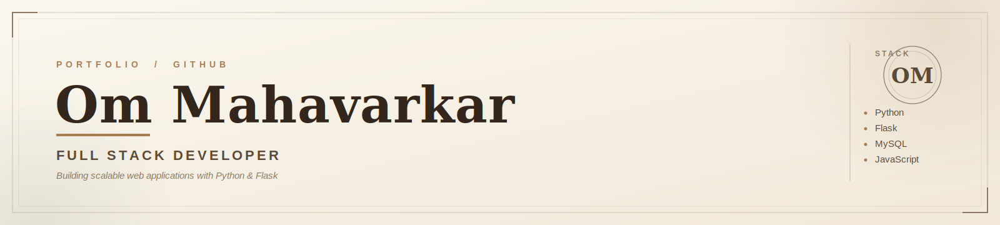

 

  

 

 

## &nbsp;&nbsp;01&nbsp;&nbsp;·&nbsp;&nbsp;About Me

Full Stack Developer with a foundation in **Python, Flask, MySQL, JavaScript, HTML, and CSS**, focused on building practical web applications that solve real-world problems. I enjoy working across the complete development journey — from designing databases and developing backend logic to creating responsive interfaces and deploying applications.

&nbsp;

- 🎓&nbsp; B.Sc. Information Technology Graduate
- 💻&nbsp; Passionate Full Stack Developer
- 🐍&nbsp; Building applications with Python & Flask
- 🗄️&nbsp; Interested in Backend Development, Database Design & REST APIs
- ☁️&nbsp; Exploring Cloud Deployment, React.js & Docker
- 🚀&nbsp; Built and deployed real-world full-stack projects
- 🎯&nbsp; Looking for Full Stack Developer Internship / Entry-Level opportunities
- 🧩&nbsp; Enjoy solving real-world problems using technology

 

<table>
<tr>

<td align="center" width="25%">

**5+**

Full Stack Projects

</td>

<td align="center" width="25%">

**12+**

Technologies Used

</td>

<td align="center" width="25%">

**2**

Cloud Platforms

Render · Aiven

</td>

<td align="center" width="25%">

**1**

Live Production App

</td>

</tr>
</table>

 

 

## &nbsp;&nbsp;02&nbsp;&nbsp;·&nbsp;&nbsp;Featured Project

<table width="100%">
<tr>

<td width="100%">

### 🍽️&nbsp; Food Waste Management Platform

A complete Full Stack web application that connects **food donors** with **NGOs** to reduce food waste efficiently — built end-to-end and deployed to production.

**Key Features**

<table width="100%">
<tr>

<td width="33%">

✔ User Authentication  
✔ Admin Dashboard  
✔ NGO Verification  

</td>

<td width="33%">

✔ Donation Tracking  
✔ Proof of Delivery  
✔ Responsive Design  

</td>

<td width="33%">

✔ Cloud Deployment  
✔ MySQL Database  
✔ Secure Login System  

</td>

</tr>
</table>

**Tech Stack**

</td>

</tr>
</table>

 

 

## &nbsp;&nbsp;03&nbsp;&nbsp;·&nbsp;&nbsp;Skills

<table width="100%">
<tr>

<td valign="top" width="25%">

**Frontend**

 

 

 

</td>

<td valign="top" width="25%">

**Backend**

 

 

</td>

<td valign="top" width="25%">

**Database**

 

</td>

<td valign="top" width="25%">

**Tools**

 

 

 

 

</td>

</tr>
</table>

 

 

## &nbsp;&nbsp;04&nbsp;&nbsp;·&nbsp;&nbsp;GitHub Analytics

 

  

 

 

## &nbsp;&nbsp;05&nbsp;&nbsp;·&nbsp;&nbsp;Education

**Bachelor of Science in Information Technology**

D.G. Ruparel College of Arts, Commerce and Science, Mumbai University

&nbsp;

| Graduation | CGPA |
|:---:|:---:|
| **2026** | **7.9** |

 

 

## &nbsp;&nbsp;06&nbsp;&nbsp;·&nbsp;&nbsp;Certifications

 

 

### “ Simplicity is the ultimate sophistication — the same holds true for code. ”

 

## &nbsp;&nbsp;07&nbsp;&nbsp;·&nbsp;&nbsp;Let’s Connect

  

 

