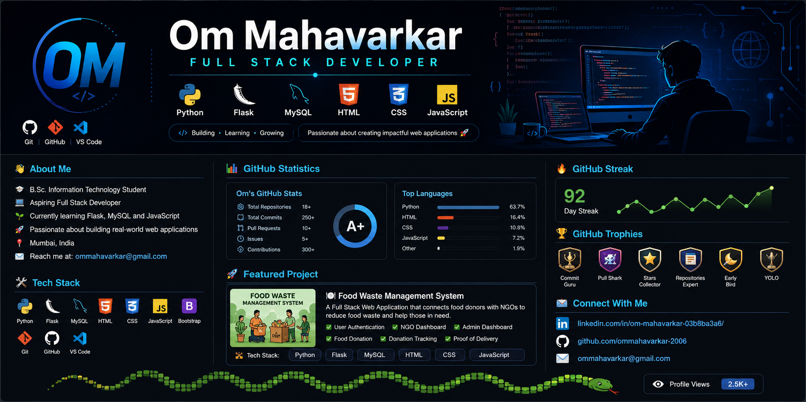

  

<h1 align="center">Hi 👋, I'm Om Mahavarkar</h1>

<h3 align="center">
Aspiring Full Stack Developer | Python • Flask • MySQL | India 🇮🇳
</h3>

---

# 👨‍💻 About Me

🎓 B.Sc. Information Technology Student

💻 Aspiring Full Stack Developer

🌱 Currently learning Flask, MySQL and JavaScript

🚀 Passionate about building real-world web applications

📍 Mumbai, India

📫 Email: **ommahavarkar@gmail.com**

---

# 🚀 Tech Stack

---

# 📈 GitHub Statistics 

 
  <!-- FIX: Replaced unstable links with optimized, fast-cached GitHub Readme Stats mirrors -->
   
   

 

# 🔥 GitHub Streak

---

# 🏆 GitHub Trophies

---

# 🚀 Featured Project

## 🍽️ Food Waste Management System

A Full Stack Web Application developed using Flask, MySQL, HTML, CSS and JavaScript.

### Features

✅ User Authentication

✅ NGO Dashboard

✅ Admin Dashboard

✅ Food Donation

✅ Donation Tracking

✅ Proof of Delivery

🔗 Repository

https://github.com/ommahavarkar-2006/FoodWasteManagement

---

# 📫 Connect With Me

💼 LinkedIn

https://www.linkedin.com/in/om-mahavarkar-03b8ba3a6/

💻 GitHub

https://github.com/ommahavarkar-2006

📧 Email

ommahavarkar@gmail.com

---

---

<h3 align="center">

⭐ Thank You for Visiting My Profile ⭐

</h3>
